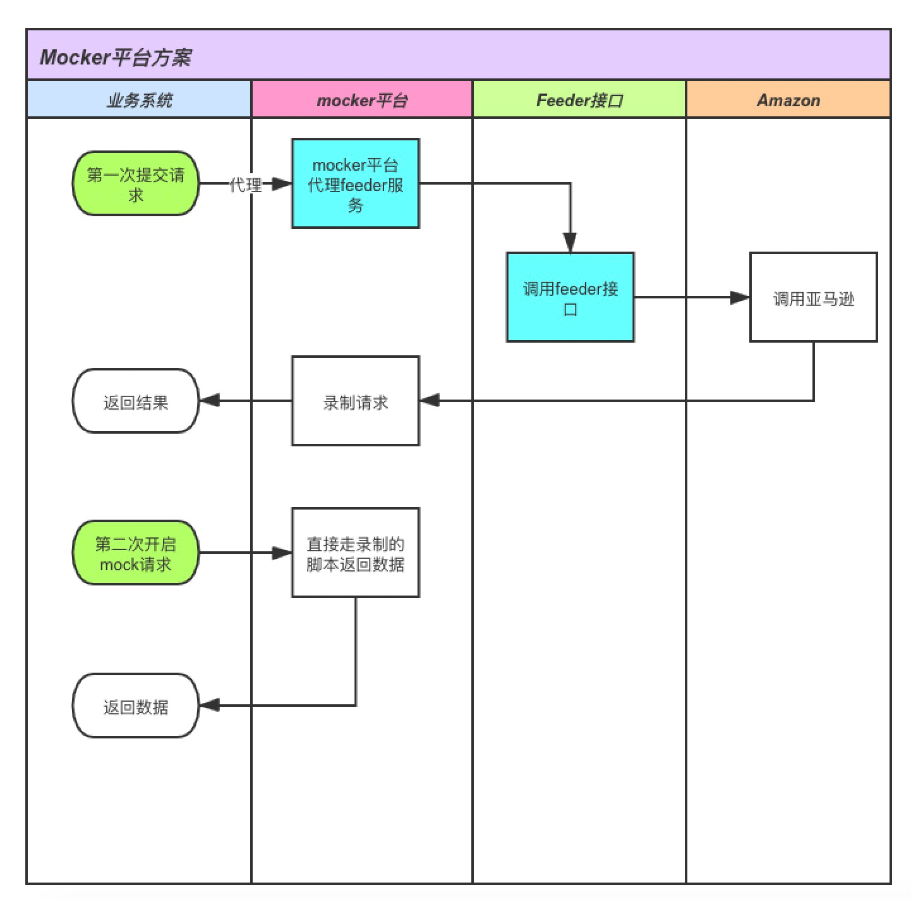

### 一个强大的mocker平台，支持mocker stub打桩，请求录制重放等功能
#### mocker平台的构想
> 目标：实现mocker机制，降低各个系统之间测试的依赖，同时在对接外部系统时降低与正式环境的交互。

#### 功能
> 1、支持注册请求和响应  
> 2、支持代理监听，录制请求，以及回放
> 3、调用端简单配置或者开关，可以动态开启mocker

#### 参考
http://wiremock.org/docs/getting-started/